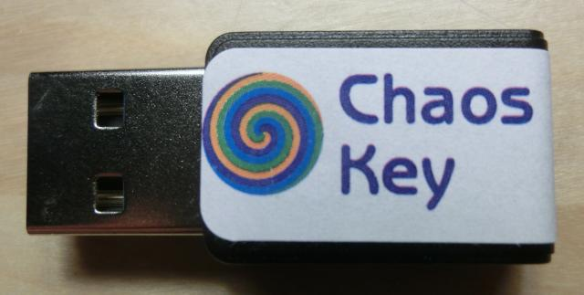

## ChaosRead — Read data from ChaosKey devices using libusb ##

This program uses libusb to directly access [ChaosKey](https://chaoskey.org) devices.

### ChaosKey USB ID ###

ChaosKey uses USB vendor 0x1d50 and USB product 0x60c6. Chaosread will
only access devices using these values.

### ChaosKey Endpoints ###

ChaosKey devices offer three entpoints:

 1. "cooked". This endpoint provides uniformly distributed random bytes. This is endpoint 0x85.

 2. "raw". This endpoint provides access to the underlying hardware
    noise source. Each 12-bit sample is delivered in the low 12 bits
    of a two byte value in LSB order. This is endpoint 0x86.

 3. "firmware". Reading from this endpoint will supply the firmware
    image loaded in the device. This is endpoint 0x87.

### ChaosRead License ###

ChaosRead is released under the GNU General Public License, as
published by the Free Software Foundation; either version 2 of the
License, or (at your option) any later version.
